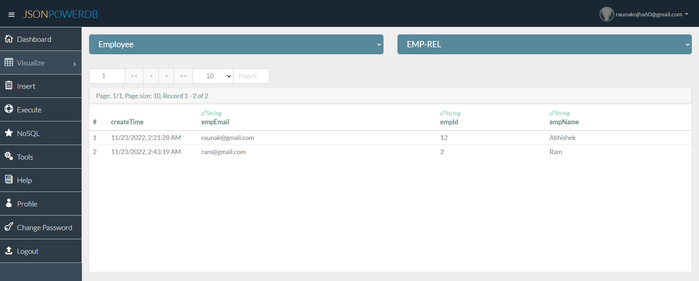

# jsonPowerDB

**Description:**

JsonPowerDB is a Database Server with Developer friendly REST API services. It's a High Performance, Light Weight, Ajax Enabled, Serverless, Simple to Use, Real-time Database.

Easy and fast to develop database applications without using any server side programming / scripting or without installing any kind of database.

Whether it's a Dynamic Website or a Mobile App or some Data Analytics Portal, the development is real fun and fast. Nothing better than trying it yourself. What all you need is a basic understanding of HTML, CSS, Bootstrap, and Javascript.

Note: Using JsonPowerDB is equally Easy and Fast when used with Server Side programming like Java, .NET, Python or PHP etc.

----------

**Benifits of using JsonPowerDB**

1. All Mobile applications that require backend database.
2. Page Caching.
3. Session Caching.
4. Existing Database applications to improve their reporting/analytics performance.
5. Best suited as backend Database for IoT.
6. Live HTML templates / themes.
7. Any software application that needs backend database.
8. Proprietary algorithm for High Performance CRUD operations. 
9. Multiple times faster than popular DBMS.
10. Serverless support for faster development - A UI developer can develop complete dynamic application.
11. DBMS with built in web / application server and embedded caching makes the performance lightning fast.
12. Server side Native NoSQL - best query performance.
13. In-built support to query on multiple JPDB databases.
14. Multi-mode DBMS - Document DB, Key-Value DB, RDBMS support.
15. Schema free - easy to develop and maintain.
16. Web-services API - Can be used with any programming language that has support for HTTP.
17. Enriched by a pluggable API Framework - A developer can develop pluggable API and plugin into any of our cloud JPDB instance
18. Standardisation of API development framework makes the development process easy, more readable, and less error prone.
19. Multiple security layers.
20. Nimble, Simple to use, In Memory, Real-time DBMS

**Screenshots of the mini-project on jsonPowerDB**

----

